# DIAGRAMA DE SECUENCIA GENERAL DEL SISTEMA DE ASISTENCIA UPeU

## DIAGRAMA DE SECUENCIA (Mermaid)

```mermaid
sequenceDiagram
    autonumber
    actor Usuario
    participant Frontend as Frontend React
    participant Router as React Router DOM
    participant AuthCtx as AuthContext
    participant Axios as Axios Interceptor
    participant JWTFilter as JwtRequestFilter
    participant AuthCtrl as AuthController
    participant UserService as IUsuarioService
    participant UserRepo as IUsuarioRepository
    participant MenuService as menuService (Frontend)
    participant AccesoCtrl as AccesoController
    participant AccesoService as IAccesoService
    participant AccesoRepo as IAccesoRepository
    participant Dashboard as Dashboard Page
    participant Sidebar as Sidebar Component
    participant AsistService as asistenciaService (Frontend)
    participant AsistCtrl as AsistenciaController
    participant AsistServ as AsistenciaServiceImp
    participant EventoRepo as IEventoEspecificoRepository
    participant QRGen as QR Code Generator
    participant FrontendQR as QR Scanner (HTML5-QRCode)
    participant GrupoRepo as IGrupoParticipanteRepository
    participant AsistRepo as IAsistenciaRepository
    participant BD as MySQL Database

    Note over Usuario,BD: FLUJO 1: AUTENTICACIÓN Y CARGA INICIAL

    Usuario->>Frontend: Accede a /login
    Frontend->>Router: Renderiza LoginPage
    Usuario->>Frontend: Ingresa username y password
    Frontend->>AuthCtx: login(username, password)
    AuthCtx->>Axios: POST /users/login {user, clave}
    Axios->>Axios: Interceptor: NO agrega token (ruta pública)
    Axios->>JWTFilter: HTTP Request POST /users/login
    JWTFilter->>JWTFilter: Valida ruta pública (permitAll)
    JWTFilter->>AuthCtrl: Request sin validación JWT
    AuthCtrl->>UserService: login(CredencialesDto)
    UserService->>UserRepo: findOneByUser(username)
    UserRepo->>BD: SELECT FROM upeu_usuario WHERE user=?
    BD-->>UserRepo: Usuario entity
    UserRepo-->>UserService: Optional<Usuario>
    UserService->>UserService: Valida contraseña con BCrypt
    UserService->>UserRepo: Consulta roles del usuario
    UserRepo->>BD: JOIN upeu_usuario_rol, upeu_roles
    BD-->>UserRepo: List<UsuarioRol>
    UserRepo-->>UserService: Roles del usuario
    UserService->>AuthCtrl: UsuarioDTO (sin token)
    AuthCtrl->>JWTFilter: Carga UserDetails
    JWTFilter->>JWTFilter: jwtUserDetailsService.loadUserByUsername()
    JWTFilter->>UserRepo: Consulta roles
    UserRepo-->>JWTFilter: UserDetails con roles
    JWTFilter->>AuthCtrl: UserDetails
    AuthCtrl->>JWTFilter: Genera JWT token
    JWTFilter->>JWTFilter: jwtTokenUtil.generateToken()
    JWTFilter->>AuthCtrl: Token JWT
    AuthCtrl-->>Axios: Response: UsuarioDTO + token JWT
    Axios->>AuthCtx: Response data
    AuthCtx->>AuthCtx: localStorage.setItem('token', token)
    AuthCtx->>AuthCtx: localStorage.setItem('user', userData)
    AuthCtx->>AuthCtx: setUser(userData)
    AuthCtx-->>Frontend: Usuario autenticado
    Frontend->>Router: navigate('/dashboard')
    Router->>Router: getRoleFromToken(token)
    Router->>Router: Redirige según rol (ej: /dashboard/lider)

    Note over Usuario,BD: FLUJO 2: CARGA DE MENÚ DINÁMICO

    Router->>Frontend: Renderiza MainLayout con PrivateRoute
    Frontend->>Sidebar: Renderiza Sidebar component
    Sidebar->>Sidebar: useEffect: loadMenu()
    Sidebar->>MenuService: getMenuByUser(username)
    MenuService->>Axios: POST /accesos/menu (username en body)
    Axios->>Axios: Interceptor: Agrega Authorization: Bearer {token}
    Axios->>JWTFilter: HTTP Request POST /accesos/menu
    JWTFilter->>JWTFilter: Extrae token del header Authorization
    JWTFilter->>JWTFilter: Valida token (firma, expiración)
    JWTFilter->>JWTFilter: jwtUserDetailsService.loadUserByUsername()
    JWTFilter->>UserRepo: Consulta usuario y roles
    UserRepo->>BD: SELECT usuario + roles
    BD-->>UserRepo: Usuario y roles
    UserRepo-->>JWTFilter: UserDetails
    JWTFilter->>JWTFilter: Establece SecurityContext
    JWTFilter->>AccesoCtrl: Request validado
    AccesoCtrl->>AccesoService: getMenuByUser(username)
    AccesoService->>AccesoRepo: getAccesoByUser(username)
    AccesoRepo->>BD: SQL JOIN: upeu_usuario → upeu_usuario_rol → upeu_roles → upeu_acceso_rol → upeu_accesos
    BD-->>AccesoRepo: List<Acceso>
    AccesoRepo-->>AccesoService: Accesos del usuario
    AccesoService->>AccesoService: Agrupa accesos en MenuGroup con MenuItem
    AccesoService-->>AccesoCtrl: List<MenuGroup>
    AccesoCtrl-->>Axios: Response: MenuGroup[]
    Axios->>MenuService: Response data
    MenuService-->>Sidebar: MenuGroup[]
    Sidebar->>Sidebar: setMenuData(menuItems)
    Sidebar->>Sidebar: Renderiza menú con iconos y rutas

    Note over Usuario,BD: FLUJO 3: GENERACIÓN DE CÓDIGO QR (LÍDER)

    Usuario->>Frontend: Navega a /asistencias/registrar (Líder)
    Frontend->>Dashboard: Renderiza RegistrarAsistenciaPage
    Dashboard->>AsistService: getSesionesDeHoy()
    AsistService->>Axios: GET /eventos-especificos/fecha?fecha=YYYY-MM-DD
    Axios->>JWTFilter: Request con token JWT
    JWTFilter->>JWTFilter: Valida token
    JWTFilter->>Frontend: Request validado
    Note over Frontend,BD: (Continúa en endpoint EventoEspecificoController)
    Frontend-->>AsistService: List<EventoEspecificoDTO>
    AsistService-->>Dashboard: Sesiones del día
    Dashboard->>Dashboard: Renderiza lista de sesiones
    Usuario->>Dashboard: Clic en "Generar QR" para una sesión
    Dashboard->>AsistService: generarQR(eventoEspecificoId, liderId)
    AsistService->>Axios: GET /asistencias/generar-qr/{eventoId}/lider/{liderId}
    Axios->>JWTFilter: Request con token JWT
    JWTFilter->>JWTFilter: Valida token y establece contexto
    JWTFilter->>AsistCtrl: Request validado
    AsistCtrl->>AsistServ: generarQRParaSesion(eventoId, liderId)
    AsistServ->>EventoRepo: findById(eventoEspecificoId)
    EventoRepo->>BD: SELECT FROM upeu_evento_especifico WHERE id=?
    BD-->>EventoRepo: EventoEspecifico entity
    EventoRepo-->>AsistServ: EventoEspecifico
    AsistServ->>AsistServ: Valida que liderId es líder de grupo del evento
    AsistServ->>GrupoRepo: Verifica liderazgo en grupos del evento
    GrupoRepo->>BD: SELECT grupos WHERE lider_id=? AND evento_general_id=?
    BD-->>GrupoRepo: List<GrupoPequeno>
    GrupoRepo-->>AsistServ: Grupos del líder
    AsistServ->>AsistServ: Construye QRAsistenciaDTO con datos de sesión
    AsistServ->>AsistServ: Serializa QRAsistenciaDTO a JSON string
    AsistServ->>QRGen: Genera imagen QR desde JSON string
    QRGen->>QRGen: Codifica QR como PNG
    QRGen-->>AsistServ: Imagen QR (byte[])
    AsistServ->>AsistServ: Codifica imagen a Base64
    AsistServ->>AsistServ: Construye QRResponseDTO {qrImageBase64, qrData, mensaje}
    AsistServ-->>AsistCtrl: QRResponseDTO
    AsistCtrl-->>Axios: Response: QRResponseDTO JSON
    Axios->>AsistService: Response data
    AsistService-->>Dashboard: QRResponseDTO
    Dashboard->>Dashboard: setQrData(response)
    Dashboard->>Dashboard: Muestra modal con imagen QR (src=qrImageBase64)
    Usuario->>Dashboard: Visualiza código QR generado

    Note over Usuario,BD: FLUJO 4: ESCANEO Y REGISTRO DE ASISTENCIA POR QR (INTEGRANTE)

    Usuario->>Frontend: Navega a /asistencias/escanear (Integrante)
    Frontend->>Dashboard: Renderiza EscanearQRPage
    Dashboard->>Dashboard: Inicializa Html5QrcodeScanner
    Dashboard->>Dashboard: Solicita acceso a cámara (getUserMedia)
    Dashboard->>Dashboard: Inicia escaneo continuo
    Usuario->>Dashboard: Apunta cámara al código QR
    Dashboard->>FrontendQR: Escanea QR exitosamente
    FrontendQR-->>Dashboard: decodedText (JSON string)
    Dashboard->>Dashboard: handleRegistro(decodedText)
    Dashboard->>Dashboard: JSON.parse(decodedText) → QRAsistenciaDTO
    Dashboard->>Dashboard: Valida que QR contenga eventoEspecificoId y timestamp
    Dashboard->>AsistService: registrarAsistencia(payload)
    Note over Dashboard: payload = {eventoEspecificoId, personaId, observacion, latitud, longitud}
    AsistService->>Axios: POST /asistencias/registrar-qr (payload)
    Axios->>Axios: Interceptor: Agrega Authorization: Bearer {token}
    Axios->>JWTFilter: Request con token JWT
    JWTFilter->>JWTFilter: Valida token
    JWTFilter->>AsistCtrl: Request validado
    AsistCtrl->>AsistServ: registrarAsistencia(AsistenciaRegistroDTO)
    AsistServ->>EventoRepo: findById(eventoEspecificoId)
    EventoRepo->>BD: SELECT FROM upeu_evento_especifico WHERE id=?
    BD-->>EventoRepo: EventoEspecifico
    EventoRepo-->>AsistServ: EventoEspecifico con fecha, horaInicio, horaFin, tolerancia
    AsistServ->>AsistServ: Validación 1: Fecha actual = fecha de sesión
    AsistServ->>AsistServ: Validación 2: Hora actual dentro de rango (30 min antes, 2 horas después)
    AsistServ->>GrupoRepo: Verifica que persona pertenezca a grupo del evento
    GrupoRepo->>BD: SELECT FROM upeu_grupo_participante JOIN upeu_grupo_pequeno WHERE persona_id=? AND evento_general_id=?
    BD-->>GrupoRepo: GrupoParticipante o null
    GrupoRepo-->>AsistServ: Verificación de pertenencia
    AsistServ->>AsistRepo: findByEventoEspecificoAndPersona(eventoId, personaId)
    AsistRepo->>BD: SELECT FROM upeu_asistencia WHERE evento_especifico_id=? AND persona_id=?
    BD-->>AsistRepo: Optional<Asistencia>
    AsistRepo-->>AsistServ: null (no existe registro previo)
    AsistServ->>AsistServ: Validación 3: No duplicados ✓
    AsistServ->>AsistServ: Determina estado: PRESENTE o TARDE según tolerancia
    AsistServ->>AsistServ: Crea nueva Asistencia entity
    AsistServ->>AsistRepo: save(Asistencia)
    AsistRepo->>BD: INSERT INTO upeu_asistencia (evento_especifico_id, persona_id, fecha_hora_registro, estado, observacion, latitud, longitud, created_at)
    BD-->>AsistRepo: Asistencia persistida
    AsistRepo-->>AsistServ: Asistencia entity con ID
    AsistServ->>AsistServ: Mapea a AsistenciaDTO mediante AsistenciaMapper
    AsistServ-->>AsistCtrl: AsistenciaDTO
    AsistCtrl-->>Axios: Response 201 CREATED: AsistenciaDTO
    Axios->>AsistService: Response data
    AsistService-->>Dashboard: AsistenciaDTO
    Dashboard->>Dashboard: setSuccess("¡Asistencia registrada! Estado: PRESENTE")
    Dashboard->>Dashboard: Oculta escáner, muestra mensaje de éxito
    Usuario->>Dashboard: Visualiza confirmación de asistencia registrada

    Note over Usuario,BD: FLUJO 5: REGISTRO MANUAL DE ASISTENCIA (LÍDER)

    Usuario->>Dashboard: Clic en "Tomar Lista" en RegistrarAsistenciaPage
    Dashboard->>AsistService: getListaLlamado(eventoEspecificoId, liderId)
    AsistService->>Axios: GET /asistencias/lista-llamado/{eventoId}/lider/{liderId}
    Axios->>JWTFilter: Request con token
    JWTFilter->>AsistCtrl: Request validado
    AsistCtrl->>AsistServ: obtenerListaParaLlamado(eventoId, liderId)
    AsistServ->>GrupoRepo: Consulta grupos del líder
    GrupoRepo->>BD: SELECT grupos_pequenos WHERE lider_id=?
    BD-->>GrupoRepo: List<GrupoPequeno>
    AsistServ->>GrupoRepo: Consulta participantes de esos grupos
    GrupoRepo->>BD: JOIN upeu_grupo_participante, upeu_persona WHERE grupo_pequeno_id IN (...)
    BD-->>GrupoRepo: List<GrupoParticipante>
    AsistServ->>AsistRepo: Consulta asistencias de la sesión
    AsistRepo->>BD: SELECT FROM upeu_asistencia WHERE evento_especifico_id=?
    BD-->>AsistRepo: List<Asistencia>
    AsistServ->>AsistServ: Combina datos: participantes + asistencias → ParticipanteAsistenciaDTO[]
    AsistServ-->>AsistCtrl: List<ParticipanteAsistenciaDTO>
    AsistCtrl-->>Axios: Response: List<ParticipanteAsistenciaDTO>
    Axios->>Dashboard: Lista de participantes
    Dashboard->>Dashboard: Muestra modal con tabla de participantes y estado
    Usuario->>Dashboard: Clic en botón estado (PRESENTE, TARDE, AUSENTE, JUSTIFICADO)
    Dashboard->>AsistService: marcarAsistenciaManual(payload)
    AsistService->>Axios: POST /asistencias/marcar-manual {eventoEspecificoId, personaId, liderId, estado, observacion}
    Axios->>JWTFilter: Request con token
    JWTFilter->>AsistCtrl: Request validado
    AsistCtrl->>AsistServ: marcarAsistenciaPorLider(eventoId, personaId, liderId, estado, observacion)
    AsistServ->>GrupoRepo: Valida que persona pertenezca a grupo del líder
    GrupoRepo->>BD: Verifica relación líder-grupo-participante
    BD-->>GrupoRepo: Confirmación
    AsistServ->>AsistServ: Crea o actualiza Asistencia con estado especificado
    AsistServ->>AsistRepo: save(Asistencia)
    AsistRepo->>BD: INSERT o UPDATE upeu_asistencia
    BD-->>AsistRepo: Asistencia persistida
    AsistRepo-->>AsistServ: Asistencia entity
    AsistServ-->>AsistCtrl: AsistenciaDTO
    AsistCtrl-->>Axios: Response 201 CREATED
    Axios->>Dashboard: AsistenciaDTO actualizada
    Dashboard->>Dashboard: Actualiza estado en tabla, muestra confirmación

    Note over Usuario,BD: FLUJO 6: CONSULTA DE DATOS (EJEMPLO: EVENTOS)

    Usuario->>Frontend: Navega a /eventos-generales (Admin)
    Frontend->>Dashboard: Renderiza EventosGeneralesPage
    Dashboard->>Dashboard: useEffect: carga datos iniciales
    Dashboard->>Frontend: eventoGeneralService.findAll()
    Note over Dashboard,BD: (servicio genérico CRUD)
    Frontend->>Axios: GET /eventos-generales
    Axios->>JWTFilter: Request con token JWT
    JWTFilter->>JWTFilter: Valida token
    JWTFilter->>Frontend: Request validado
    Note over Frontend,BD: (Continúa en EventoGeneralController)
    Frontend-->>Dashboard: List<EventoGeneralDTO>
    Dashboard->>Dashboard: Renderiza tabla con eventos
    Usuario->>Dashboard: Visualiza lista de eventos

    Note over Usuario,BD: FLUJO 7: IMPORTACIÓN DE MATRÍCULAS DESDE EXCEL

    Usuario->>Frontend: Navega a /matriculas/importar (Admin)
    Frontend->>Dashboard: Renderiza ImportarExcelPage
    Dashboard->>Dashboard: Carga catálogos (sedes, periodos)
    Dashboard->>Frontend: importService.getSedes(), periodosService.getAll()
    Frontend->>Axios: Múltiples GET requests
    Axios->>BD: Consultas a catálogos
    BD-->>Dashboard: Datos de catálogos
    Usuario->>Dashboard: Selecciona archivo Excel
    Usuario->>Dashboard: Selecciona filtros (sede, facultad, programa, periodo)
    Usuario->>Dashboard: Clic en "Importar"
    Dashboard->>Dashboard: FormData.append('file', file)
    Dashboard->>Dashboard: FormData.append('sedeId', ...)
    Dashboard->>Frontend: importService.importExcel(file, filtros)
    Frontend->>Axios: POST /matriculas/importar (multipart/form-data)
    Axios->>JWTFilter: Request con token
    JWTFilter->>Frontend: Request validado
    Note over Frontend,BD: (Continúa en MatriculaController)
    Frontend->>Frontend: Procesa archivo con Apache POI
    Frontend->>Frontend: Valida estructura y datos
    Frontend->>BD: INSERT múltiples registros en upeu_matricula y upeu_persona
    BD-->>Frontend: Resultados de inserción
    Frontend-->>Dashboard: ImportResultDTO {exitosos, fallidos, errores}
    Dashboard->>Dashboard: Muestra resultados de importación
    Usuario->>Dashboard: Visualiza resumen de importación
```

---

## EXPLICACIÓN NARRATIVA DEL FLUJO COMPLETO DEL SISTEMA

El diagrama de secuencia modela el flujo de interacción entre los distintos componentes del sistema durante los escenarios clave de operación, desde la autenticación inicial hasta el registro de asistencias mediante códigos QR y mecanismos manuales. La explicación narrativa que sigue describe paso a paso cómo se comporta el sistema en cada uno de estos escenarios, detallando el recorrido de la información entre las capas de presentación, lógica de negocio y persistencia.

### Flujo 1: Autenticación y Carga Inicial del Sistema

El proceso comienza cuando un usuario accede al sistema mediante la ruta `/login`. El componente React `LoginPage` se renderiza gracias a `React Router DOM`, que maneja la navegación del lado del cliente. El usuario ingresa sus credenciales (username y contraseña) en el formulario de inicio de sesión. Al hacer clic en el botón de login, el componente `LoginPage` invoca la función `login()` del contexto de autenticación (`AuthContext`), que actúa como proveedor global de estado para la información de sesión del usuario.

El `AuthContext` delega la operación al servicio `authService`, que utiliza la instancia configurada de Axios para enviar una petición HTTP POST al endpoint `/users/login` del backend. Esta petición incluye en el cuerpo un objeto JSON con los campos `user` (username) y `clave` (contraseña). Es importante notar que el interceptor de Axios no agrega el token JWT en esta petición, ya que la ruta de login está configurada como pública en el backend mediante Spring Security.

La petición HTTP llega al servidor Spring Boot y es interceptada por el filtro `JwtRequestFilter`. Este filtro, que implementa `OncePerRequestFilter` de Spring Security, verifica primero si la ruta es pública mediante la configuración definida en `WebSecurityConfig`. Como la ruta `/users/login` está marcada como `permitAll()`, el filtro permite que la petición continúe sin requerir autenticación.

La petición llega entonces al `AuthController`, específicamente al método `login()` anotado con `@PostMapping`. Este controlador inyecta el servicio `IUsuarioService` mediante inyección de dependencias de Spring (usando `@RequiredArgsConstructor` de Lombok). El controlador delega la validación de credenciales al servicio, pasándole un objeto `UsuarioDTO.CredencialesDto` que fue validado previamente con anotaciones Bean Validation (`@Valid`, `@NotBlank`).

El servicio `IUsuarioService` realiza la lógica de autenticación. Primero, consulta la base de datos mediante el repositorio `IUsuarioRepository`, ejecutando un método derivado de Spring Data JPA (`findOneByUser()`), que se traduce a una consulta SQL SELECT sobre la tabla `upeu_usuario` filtrando por el campo `user`. Hibernate, como implementación de JPA, ejecuta esta consulta contra la base de datos MySQL y retorna una entidad `Usuario` si existe, o un `Optional` vacío si no.

Una vez obtenida la entidad `Usuario`, el servicio compara la contraseña proporcionada con el hash almacenado en la base de datos. Esta comparación utiliza BCrypt, un algoritmo de hash unidireccional que permite verificar contraseñas sin almacenarlas en texto plano. El servicio genera un objeto `PasswordEncoder` mediante `BCryptPasswordEncoder`, que compara el hash de la contraseña ingresada con el hash almacenado en el campo `clave` de la tabla `upeu_usuario`.

Si las credenciales son válidas, el servicio consulta los roles asignados al usuario mediante una relación many-to-many entre `Usuario` y `Rol` a través de la tabla intermedia `upeu_usuario_rol`. El repositorio ejecuta una consulta SQL con JOINs para obtener todos los roles asociados al usuario. Estos roles son necesarios tanto para generar el token JWT como para construir el menú de navegación posteriormente.

El servicio retorna al controlador un objeto `UsuarioDTO` que contiene información básica del usuario (idUsuario, user, estado, personaId) pero sin el token JWT aún. El controlador entonces invoca al `JwtUserDetailsService`, que implementa la interfaz `UserDetailsService` de Spring Security. Este servicio carga el usuario desde la base de datos nuevamente y construye un objeto `UserDetails` que incluye el username, la contraseña hasheada, y una lista de `GrantedAuthority` basada en los roles del usuario.

El controlador utiliza el componente `JwtTokenUtil` para generar el token JWT. Este componente toma el `UserDetails` y crea un objeto JWT con los siguientes claims: el sujeto (`sub`) que contiene el username, un claim `role` que contiene los roles del usuario separados por comas, un claim `app` con el valor "sysasistencia", el timestamp de emisión (`iat`), y el timestamp de expiración (`exp`) calculado como la hora actual más 5 horas. El token se firma utilizando una clave secreta configurada en el archivo de propiedades de Spring Boot mediante el algoritmo HMAC-SHA.

El token JWT generado se incluye en el objeto `UsuarioDTO` que el controlador retorna como respuesta HTTP 200 OK. La respuesta se serializa a JSON mediante Jackson y viaja de vuelta por la red al frontend. El servicio `authService` en el frontend recibe esta respuesta y extrae tanto el token como los datos del usuario.

El token JWT se almacena en el `localStorage` del navegador mediante `localStorage.setItem('token', token)`, lo que permite que persista entre recargas de página. Los datos del usuario también se almacenan en `localStorage` como un objeto JSON serializado. El `AuthContext` actualiza su estado interno mediante `setUser(userData)`, lo que provoca que todos los componentes suscritos al contexto se re-rendericen con la nueva información de usuario.

Una vez completada la autenticación, el `LoginPage` utiliza el hook `useNavigate()` de React Router para redirigir al usuario a la ruta `/dashboard`. El componente `NavigateToDashboard` decodifica el token JWT almacenado en el `localStorage` utilizando una función auxiliar (`getRoleFromToken()`) que parsea el payload del token y extrae el claim `role`. Según el rol extraído (ADMIN, LIDER, INTEGRANTE, o SUPERADMIN), el router redirige al usuario al dashboard correspondiente, por ejemplo `/dashboard/lider` para usuarios con rol LIDER.

### Flujo 2: Carga de Menú Dinámico según Rol

Cuando el usuario autenticado accede a una ruta protegida, el componente `MainLayout` se renderiza. Este layout incluye el componente `Sidebar`, que es responsable de mostrar el menú de navegación lateral. El `Sidebar` utiliza el hook `useAuth()` para obtener el usuario actual del contexto de autenticación.

El componente `Sidebar` ejecuta un `useEffect` que se dispara cuando el componente se monta o cuando cambia el usuario. Este efecto invoca la función `loadMenu()`, que llama al servicio `menuService.getMenuByUser()` pasando el username del usuario autenticado. El servicio `menuService` es una capa de abstracción sobre Axios que encapsula la lógica de comunicación con el endpoint específico del backend.

La petición HTTP POST se envía al endpoint `/accesos/menu` con el username como cuerpo de la petición (contenido tipo `text/plain`). Antes de enviar la petición, el interceptor de Axios ejecuta su función de configuración. Este interceptor verifica si existe un token JWT en el `localStorage` mediante `localStorage.getItem('token')`. Si el token existe, lo agrega automáticamente al header `Authorization` de la petición HTTP con el formato `Bearer {token}`.

La petición HTTP llega al servidor Spring Boot y es interceptada nuevamente por el `JwtRequestFilter`. En esta ocasión, la ruta `/accesos/menu` no está en la lista de rutas públicas, por lo que el filtro debe validar el token JWT. El filtro extrae el token del header `Authorization`, separando el prefijo "Bearer " del valor del token.

El filtro utiliza el componente `JwtTokenUtil` para validar el token. La validación incluye verificar que el token tenga el formato correcto (tres partes separadas por puntos: header.payload.signature), que la firma sea válida utilizando la clave secreta, y que el token no haya expirado comparando el claim `exp` con la fecha y hora actual. Si alguna de estas validaciones falla, el filtro establece un atributo en el request con un mensaje de error y permite que la petición continúe, pero el `JwtAuthenticationEntryPoint` interceptará la respuesta y retornará un error 401 Unauthorized.

Si el token es válido, el filtro extrae el username del claim `sub` del token y carga los detalles del usuario mediante `JwtUserDetailsService.loadUserByUsername()`. Este servicio consulta la base de datos para obtener el usuario y sus roles, construyendo un objeto `UserDetails` con las autoridades (roles) del usuario. El filtro establece entonces el contexto de seguridad de Spring mediante `SecurityContextHolder.getContext().setAuthentication()`, creando un `UsernamePasswordAuthenticationToken` con el `UserDetails` y sus autoridades.

Una vez establecido el contexto de seguridad, la petición continúa hacia el `AccesoController`. El controlador invoca al servicio `IAccesoService` mediante el método `getMenuByUser()`, pasando el username como parámetro. Este servicio implementa la lógica de negocio para construir el menú dinámico.

El servicio consulta la base de datos mediante el repositorio `IAccesoRepository`, ejecutando una consulta SQL nativa compleja que realiza múltiples JOINs entre las tablas `upeu_usuario`, `upeu_usuario_rol`, `upeu_roles`, `upeu_acceso_rol`, y `upeu_accesos`. Esta consulta obtiene todos los accesos (permisos) asignados a los roles que tiene el usuario autenticado.

El servicio recibe una lista de entidades `Acceso`, cada una con información sobre un permiso (nombre, URL, icono). El servicio agrupa estos accesos en una estructura jerárquica de menús. Crea objetos `MenuGroup` que pueden contener `MenuItem` anidados, o actuar como enlaces directos si no tienen items. La lógica de agrupación organiza los accesos en categorías como "Gestión Académica", "Eventos", o "Asistencias", basándose en patrones en las URLs o en reglas de negocio específicas.

El servicio retorna una lista de `MenuGroup` al controlador, que la envuelve en un `ResponseEntity` con código HTTP 200 OK. La respuesta JSON viaja de vuelta al frontend, donde el servicio `menuService` la recibe y la retorna al componente `Sidebar`.

El `Sidebar` actualiza su estado interno mediante `setMenuData(menuItems)`, lo que provoca un re-renderizado del componente. El componente itera sobre la lista de `MenuGroup` y renderiza cada elemento del menú. Para los grupos que tienen items anidados, renderiza un header colapsable con un icono Font Awesome (mapeado desde el campo `icono` de la base de datos) y un nombre. Los items individuales se renderizan como enlaces de navegación (`NavLink` de React Router) que permiten al usuario navegar a las diferentes páginas del sistema.

El componente `Sidebar` también gestiona el estado de expansión de los grupos de menú. Detecta la ruta actual mediante el hook `useLocation()` de React Router y expande automáticamente el grupo que contiene el item activo. Esto proporciona una mejor experiencia de usuario al mantener visible la sección del menú relevante para la página actual.

### Flujo 3: Generación de Código QR para Sesión

Cuando un usuario con rol LÍDER accede a la página de registro de asistencia (`RegistrarAsistenciaPage`), el componente primero carga las sesiones programadas para el día actual. El componente ejecuta un `useEffect` que invoca al servicio `asistenciaService.getSesionesDeHoy()`. Este servicio construye la fecha actual en formato ISO (YYYY-MM-DD) y envía una petición HTTP GET al endpoint `/eventos-especificos/fecha?fecha={fecha}`.

La petición es interceptada por el filtro JWT, que valida el token y establece el contexto de seguridad. El `EventoEspecificoController` recibe la petición y delega al servicio `IEventoEspecificoService`, que consulta el repositorio `IEventoEspecificoRepository`. El repositorio ejecuta un método derivado de JPA (`findByFecha()`) que se traduce a una consulta SQL SELECT sobre la tabla `upeu_evento_especifico` filtrando por la columna `fecha`. Hibernate ejecuta la consulta y retorna una lista de entidades `EventoEspecifico`.

Las entidades se mapean a DTOs mediante `EventoEspecificoMapper` de MapStruct, que transforma automáticamente las entidades JPA en objetos `EventoEspecificoDTO` más ligeros y optimizados para transferencia de red. Estos DTOs se retornan al frontend, donde el componente `RegistrarAsistenciaPage` los recibe y los muestra en una tabla, permitiendo al líder seleccionar la sesión para la cual desea generar un código QR.

Cuando el líder hace clic en el botón "Generar QR" para una sesión específica, el componente invoca al servicio `asistenciaService.generarQR()`, pasando el `eventoEspecificoId` de la sesión y el `personaId` del líder (obtenido del contexto de autenticación). El servicio construye la URL del endpoint `/asistencias/generar-qr/{eventoEspecificoId}/lider/{liderId}` y envía una petición HTTP GET.

La petición llega al `AsistenciaController`, específicamente al método `generarQR()`. Este método delega la operación al servicio `AsistenciaServiceImp.generarQRParaSesion()`. El servicio primero consulta el repositorio `IEventoEspecificoRepository` para obtener los detalles completos de la sesión, incluyendo la fecha, hora de inicio, hora de fin, lugar, tolerancia en minutos, y la relación con el evento general.

El servicio valida que el `liderId` proporcionado corresponda efectivamente a un líder de al menos un grupo pequeño asociado al evento general de la sesión. Esta validación se realiza consultando el repositorio `IGrupoPequenoRepository` y verificando que exista un grupo donde el campo `lider_id` coincida con el `liderId` y donde el `grupo_general_id` esté asociado al `evento_general_id` de la sesión. Si esta validación falla, el servicio lanza una excepción que se traduce en un error HTTP 400 Bad Request con un mensaje descriptivo.

Si la validación es exitosa, el servicio construye un objeto `QRAsistenciaDTO` que contiene toda la información necesaria para que un integrante pueda registrar su asistencia escaneando el QR. Este DTO incluye el `eventoEspecificoId` (identificador de la sesión), el nombre del evento general, el nombre de la sesión, la fecha, las horas de inicio y fin, la tolerancia en minutos, el lugar, y un timestamp que indica el momento de generación del QR (útil para validaciones de vigencia posteriores).

El servicio serializa este objeto DTO a una cadena JSON utilizando Jackson (mediante `ObjectMapper`). Esta cadena JSON se convierte en el contenido del código QR. El servicio utiliza una biblioteca de generación de códigos QR (probablemente ZXing o similar) para crear una imagen PNG del código QR codificando la cadena JSON.

La biblioteca de generación QR procesa la cadena JSON y genera una matriz de píxeles que representa el código QR bidimensional. Esta matriz se convierte en una imagen PNG en formato binario (array de bytes). El servicio entonces codifica esta imagen binaria en formato Base64, que es una codificación de texto que representa datos binarios usando caracteres ASCII. Esta codificación es necesaria para poder incluir la imagen en una respuesta JSON, ya que JSON solo puede contener texto.

El servicio construye un objeto `QRResponseDTO` que contiene tres campos principales: `qrImageBase64`, que es la cadena Base64 de la imagen QR precedida por el prefijo `data:image/png;base64,` (permitiendo que el frontend la use directamente en un elemento ``), `qrData`, que es el objeto `QRAsistenciaDTO` original (útil para referencias del frontend), y `mensaje`, que es un mensaje de confirmación.

Este objeto `QRResponseDTO` se retorna al controlador, que lo envuelve en un `ResponseEntity` con código HTTP 200 OK. La respuesta JSON viaja al frontend, donde el servicio `asistenciaService` la recibe y la retorna al componente `RegistrarAsistenciaPage`.

El componente actualiza su estado mediante `setQrData(response)`, lo que provoca un re-renderizado. El componente muestra un modal superpuesto que contiene la imagen del código QR. La imagen se renderiza utilizando un elemento HTML `` cuyo atributo `src` se establece directamente con el valor de `qrData.qrImageBase64`. El navegador decodifica automáticamente la cadena Base64 y muestra la imagen del código QR.

El líder puede entonces compartir esta imagen con los integrantes de su grupo, ya sea mostrándola en una pantalla, imprimiéndola, o enviándola por algún medio digital. El código QR contiene toda la información necesaria para que un integrante pueda registrar su asistencia posteriormente.

### Flujo 4: Escaneo y Registro de Asistencia mediante Código QR

Cuando un usuario con rol INTEGRANTE accede a la página de escaneo QR (`EscanearQRPage`), el componente React inicializa la biblioteca `HTML5-QRCode` para habilitar el escaneo de códigos QR mediante la cámara del dispositivo. El componente ejecuta un `useEffect` que crea una instancia de `Html5QrcodeScanner`, configurando un área de escaneo de 250x250 píxeles y una velocidad de captura de 10 fotogramas por segundo.

La biblioteca HTML5-QRCode utiliza la API WebRTC (`navigator.mediaDevices.getUserMedia()`) para solicitar acceso a la cámara del dispositivo. El navegador muestra un diálogo de permiso al usuario solicitando autorización para acceder a la cámara. Si el usuario otorga el permiso, el navegador inicia el flujo de video desde la cámara y lo renderiza en el elemento HTML `
` con id `qr-reader`.

El escáner ejecuta un bucle continuo de captura de fotogramas y análisis de códigos QR. Cada fotograma es procesado por algoritmos de detección de códigos QR que identifican los patrones característicos de estos códigos bidimensionales. Cuando el escáner detecta un código QR válido en el fotograma actual, ejecuta una función callback (`onScanSuccess`) pasando como parámetro la cadena de texto decodificada del QR.

La cadena decodificada debería ser un JSON string que representa un objeto `QRAsistenciaDTO`. El componente `EscanearQRPage` intenta parsear esta cadena utilizando `JSON.parse()`. Si el parseo es exitoso, el componente valida que el objeto resultante contenga los campos esenciales `eventoEspecificoId` y `timestamp`. Si alguna de estas validaciones falla, el componente muestra un mensaje de error al usuario y detiene el escaneo.

El componente también verifica que el usuario esté autenticado y que tenga un `personaId` asociado, que se obtiene del contexto de autenticación. Si el usuario no está correctamente autenticado, se muestra un error y se detiene el proceso.

Una vez validado el QR, el componente construye un objeto payload que contiene el `eventoEspecificoId` extraído del QR, el `personaId` del usuario autenticado, una observación predeterminada ("Registrado por QR"), y campos opcionales para coordenadas GPS (latitud y longitud, que en la implementación actual se envían como null pero están preparados para futuras mejoras de geolocalización).

El componente invoca entonces al servicio `asistenciaService.registrarAsistencia()`, que envía una petición HTTP POST al endpoint `/asistencias/registrar-qr` con el payload en el cuerpo de la petición en formato JSON. El interceptor de Axios agrega automáticamente el token JWT al header `Authorization` de la petición.

La petición llega al servidor y es interceptada por el `JwtRequestFilter`, que valida el token y establece el contexto de seguridad. La petición continúa hacia el `AsistenciaController`, específicamente al método `registrarAsistenciaPorQR()`, que recibe un objeto `AsistenciaRegistroDTO` en el cuerpo de la petición.

El controlador delega la operación al servicio `AsistenciaServiceImp.registrarAsistencia()`. Este servicio implementa una secuencia de validaciones estrictas antes de permitir el registro de asistencia. Primero, consulta el repositorio `IEventoEspecificoRepository` para obtener los detalles completos de la sesión, incluyendo la fecha, las horas de inicio y fin, la tolerancia en minutos, y la relación con el evento general.

El servicio ejecuta la primera validación: verifica que la fecha actual (obtenida mediante `LocalDate.now()`) coincida exactamente con la fecha de la sesión almacenada en la base de datos. Esta validación asegura que solo se pueda registrar asistencia el día programado para la sesión, previniendo registros anticipados o tardíos.

La segunda validación verifica el horario permitido para el registro. El servicio calcula un rango temporal que inicia 30 minutos antes de la hora de inicio de la sesión y finaliza 2 horas después de la hora de fin de la sesión. La hora actual (obtenida mediante `LocalDateTime.now()`) se compara con este rango. Si la hora actual está fuera de este rango, el servicio lanza una excepción con un mensaje descriptivo indicando que el registro no está permitido en ese momento.

La tercera validación verifica que la persona que intenta registrar asistencia esté efectivamente inscrita en un grupo del evento general. Esta validación se realiza mediante una consulta compleja al repositorio `IGrupoParticipanteRepository` que busca si existe una relación entre la persona y algún grupo pequeño que esté asociado al evento general de la sesión. La consulta ejecuta múltiples JOINs entre las tablas `upeu_grupo_participante`, `upeu_grupo_pequeno`, `upeu_grupo_general`, y `upeu_evento_general` para verificar esta pertenencia.

La cuarta validación verifica que no exista ya un registro de asistencia para esta combinación de sesión y persona. El servicio consulta el repositorio `IAsistenciaRepository` mediante el método `findByEventoEspecificoIdEventoEspecificoAndPersonaIdPersona()`, que se traduce a una consulta SQL SELECT con un WHERE que filtra por ambos campos. La tabla `upeu_asistencia` tiene una constraint UNIQUE en la combinación `(evento_especifico_id, persona_id)`, lo que previene duplicados a nivel de base de datos, pero la validación en el servicio proporciona un mensaje de error más claro antes de intentar la inserción.

Si todas las validaciones son exitosas, el servicio procede a determinar el estado de la asistencia. Compara la hora actual con la hora de inicio de la sesión más la tolerancia en minutos. Si la persona registra su asistencia antes de que se exceda la tolerancia, el estado se establece como `PRESENTE`. Si la hora actual excede la hora de inicio más la tolerancia, pero aún está dentro del rango permitido (2 horas después del fin), el estado se establece como `TARDE`.

El servicio crea entonces una nueva entidad `Asistencia` utilizando el patrón Builder de Lombok. Esta entidad incluye referencias a las entidades `EventoEspecifico` y `Persona` (establecidas mediante los IDs), el timestamp actual como `fechaHoraRegistro`, el estado determinado (PRESENTE o TARDE), la observación proporcionada, y las coordenadas GPS opcionales. El campo `created_at` se establece automáticamente mediante la anotación `@PrePersist` antes de la persistencia.

El servicio invoca al repositorio `IAsistenciaRepository.save()` para persistir la nueva entidad. Hibernate, como implementador de JPA, genera una consulta SQL INSERT que inserta un nuevo registro en la tabla `upeu_asistencia` con todos los campos de la entidad. La base de datos MySQL ejecuta la inserción y retorna la entidad actualizada con su ID generado automáticamente.

La entidad persistida se mapea a un DTO mediante `AsistenciaMapper` de MapStruct. Este mapper transforma las referencias a entidades relacionadas en IDs y nombres planos en el DTO (por ejemplo, `eventoEspecifico.nombreSesion` se mapea a `eventoNombre` en el DTO). El DTO resultante se retorna al controlador, que lo envuelve en un `ResponseEntity` con código HTTP 201 CREATED.

La respuesta JSON viaja de vuelta al frontend, donde el servicio `asistenciaService` la recibe. Si el registro fue exitoso, el componente `EscanearQRPage` actualiza su estado mostrando un mensaje de éxito con el estado de la asistencia registrada (PRESENTE o TARDE). El componente oculta el área de escaneo y muestra un ícono de confirmación, permitiendo al usuario escanear otro QR si es necesario.

Si alguna validación falla en el backend, el servicio lanza una excepción `RuntimeException` con un mensaje descriptivo. El controlador captura esta excepción y retorna una respuesta HTTP 400 Bad Request con el mensaje de error. El componente frontend captura este error y lo muestra al usuario, permitiendo que intente nuevamente o contacte al líder para asistencia manual.

### Flujo 5: Registro Manual de Asistencia por Líder

El proceso de registro manual comienza cuando el líder hace clic en el botón "Tomar Lista" para una sesión específica en la página `RegistrarAsistenciaPage`. El componente muestra un modal que contiene una tabla con todos los participantes de los grupos liderados por ese líder.

Para construir esta lista, el componente invoca al servicio `asistenciaService.getListaLlamado()`, que envía una petición HTTP GET al endpoint `/asistencias/lista-llamado/{eventoEspecificoId}/lider/{liderId}`. La petición es validada por el filtro JWT y llega al `AsistenciaController`, que delega al servicio `AsistenciaServiceImp.obtenerListaParaLlamado()`.

Este servicio ejecuta una lógica compleja de agregación de datos. Primero, consulta el repositorio `IGrupoPequenoRepository` para obtener todos los grupos pequeños donde el campo `lider_id` coincide con el `liderId` proporcionado. Luego, para cada uno de estos grupos, consulta el repositorio `IGrupoParticipanteRepository` para obtener todos los participantes activos (donde `estado = 'ACTIVO'`).

El servicio también consulta el repositorio `IAsistenciaRepository` para obtener todas las asistencias registradas para la sesión específica. Luego, combina estos datos creando objetos `ParticipanteAsistenciaDTO` que incluyen información de la persona (nombre, código, documento), el nombre del grupo pequeño al que pertenece, y el estado de asistencia (si ya tiene un registro, muestra PRESENTE, TARDE, AUSENTE, o JUSTIFICADO; si no tiene registro, muestra PENDIENTE).

Esta lista combinada se retorna al frontend, donde el componente `ListaAsistenciaModal` la muestra en una tabla interactiva. Cada fila de la tabla muestra la información del participante y botones para marcar diferentes estados de asistencia (PRESENTE, TARDE, AUSENTE, JUSTIFICADO).

Cuando el líder hace clic en uno de estos botones (por ejemplo, el botón "PRESENTE"), el componente invoca al servicio `asistenciaService.marcarAsistenciaManual()`, construyendo un payload que incluye el `eventoEspecificoId`, el `personaId` del participante, el `liderId` del líder, el estado seleccionado, y una observación descriptiva.

La petición HTTP POST se envía al endpoint `/asistencias/marcar-manual`. El servicio backend `AsistenciaServiceImp.marcarAsistenciaPorLider()` valida primero que el líder efectivamente tenga grupos asociados al evento y que la persona especificada sea participante de uno de esos grupos. Esta validación previene que un líder marque asistencias de participantes que no pertenecen a sus grupos.

Si la validación es exitosa, el servicio crea o actualiza el registro de asistencia con el estado especificado por el líder. A diferencia del registro por QR, en el registro manual el líder puede establecer directamente cualquier estado (PRESENTE, TARDE, AUSENTE, JUSTIFICADO) sin que el sistema determine automáticamente el estado basándose en el horario.

El registro se persiste en la base de datos y se retorna al frontend, donde el componente actualiza la fila correspondiente en la tabla, mostrando el nuevo estado y deshabilitando el botón del estado actual para indicar que ya fue marcado.

### Flujo 6: Consulta de Datos y Operaciones CRUD

Los flujos de consulta y operaciones CRUD (Create, Read, Update, Delete) siguen un patrón similar pero más simplificado que los flujos de autenticación y asistencias. Cuando un usuario accede a una página que requiere cargar datos (por ejemplo, la página de eventos generales), el componente React ejecuta un `useEffect` que invoca a un servicio correspondiente.

Estos servicios utilizan frecuentemente un servicio genérico CRUD (`crudService`) que proporciona métodos estándar como `findAll()`, `findById()`, `save()`, `update()`, y `delete()`. El servicio genérico construye automáticamente las URLs de los endpoints basándose en el nombre del recurso (por ejemplo, "eventos-generales" se mapea a `/eventos-generales`).

Las peticiones HTTP pasan por el mismo flujo de autenticación JWT que las demás operaciones. Una vez validadas, llegan a los controladores correspondientes (por ejemplo, `EventoGeneralController`, `FacultadController`, `ProgramaEstudioController`), que delegan a los servicios de la capa de negocio.

Los servicios consultan los repositorios JPA, que ejecutan queries SQL automáticas (generadas por Hibernate) o consultas personalizadas definidas mediante `@Query`. Las entidades JPA se mapean a DTOs mediante los mappers de MapStruct, y estos DTOs se retornan al frontend como respuestas JSON.

El frontend recibe estos datos y los renderiza en tablas, formularios, o componentes de visualización según corresponda. Las operaciones de creación y actualización siguen el flujo inverso: el frontend envía DTOs al backend, que los mapea a entidades y los persiste en la base de datos.

### Flujo 7: Importación Masiva de Matrículas desde Excel

El flujo de importación de matrículas es particularmente complejo debido a la necesidad de procesar archivos binarios (Excel) y realizar múltiples validaciones y transformaciones de datos.

Cuando un administrador accede a la página de importación de Excel, el componente carga primero los catálogos necesarios (sedes, facultades, programas, periodos) mediante múltiples peticiones HTTP GET. Estos catálogos se muestran en formularios de selección que permiten al administrador aplicar filtros antes de la importación.

Cuando el administrador selecciona un archivo Excel y aplica los filtros deseados, el componente construye un objeto `FormData` (API nativa del navegador para envío de archivos multipart). El archivo se agrega al FormData mediante `FormData.append('file', file)`, y los filtros también se agregan como campos del FormData.

La petición HTTP POST se envía al endpoint `/matriculas/importar` con el Content-Type `multipart/form-data`. El backend Spring Boot recibe el archivo como un objeto `MultipartFile` y los filtros como parámetros de query o campos del FormData.

El servicio `IMatriculaService.importarDesdeExcel()` utiliza Apache POI para leer el archivo Excel. Apache POI puede procesar tanto formatos .xlsx (mediante `XSSFWorkbook`) como .xls (mediante `HSSFWorkbook`). El servicio lee cada fila del archivo Excel y mapea las columnas a un objeto `MatriculaExcelDTO`.

Para cada fila, el servicio ejecuta múltiples validaciones: verifica que los campos requeridos no estén vacíos, valida que las referencias (sede, facultad, programa, periodo) existan en la base de datos, verifica la unicidad de códigos de estudiante y documentos, y aplica los filtros especificados por el administrador.

Si una fila pasa todas las validaciones, el servicio crea o actualiza las entidades `Persona` y `Matricula` en la base de datos. Las operaciones se realizan dentro de transacciones gestionadas por Spring para asegurar atomicidad. Si ocurre un error en una fila, el servicio continúa procesando las demás filas y registra el error en una lista para reportarlo al final.

Al finalizar el procesamiento de todas las filas, el servicio construye un objeto `ImportResultDTO` que contiene estadísticas del proceso: total de registros procesados, cantidad exitosos, cantidad fallidos, lista de errores descriptivos, y lista de advertencias. Este objeto se retorna al frontend, donde el componente muestra un resumen detallado de la importación, permitiendo al administrador revisar los errores y tomar acciones correctivas si es necesario.

### Consideraciones Arquitectónicas Generales

A lo largo de todos estos flujos, varios principios arquitectónicos se mantienen consistentes. La separación de responsabilidades entre las capas (Controller-Service-Repository) permite que cada componente tenga una responsabilidad única y bien definida. La transformación entre entidades de dominio y DTOs mediante mappers (MapStruct) mantiene desacopladas las capas y optimiza la transferencia de datos.

La seguridad se implementa de manera centralizada mediante Spring Security y el filtro JWT, asegurando que todas las operaciones sensibles requieran autenticación válida. La gestión de errores se maneja mediante excepciones controladas y un manejador global de excepciones (`RestExceptionHandler`), que proporciona respuestas de error consistentes en todo el sistema.

La persistencia se gestiona mediante JPA/Hibernate, que abstrae las operaciones de base de datos y proporciona capacidades de mapeo objeto-relacional avanzadas. Las consultas se optimizan mediante índices en la base de datos y mediante el uso de lazy loading y eager fetching según corresponda.

En el frontend, la gestión de estado se distribuye entre el estado local de componentes React (para datos específicos de una página) y el contexto global de autenticación (para información de sesión compartida). Los servicios actúan como capa de abstracción sobre Axios, proporcionando una API limpia y consistente para los componentes.

La comunicación entre frontend y backend se realiza exclusivamente mediante HTTP/REST, utilizando JSON como formato de intercambio de datos. Los interceptores de Axios agregan automáticamente los tokens JWT y manejan errores de autenticación de manera global, proporcionando una experiencia de usuario fluida.

Este diseño arquitectónico permite que el sistema sea escalable, mantenible y seguro, cumpliendo con los requisitos funcionales de un sistema de gestión de asistencia basado en códigos QR para eventos académicos.

